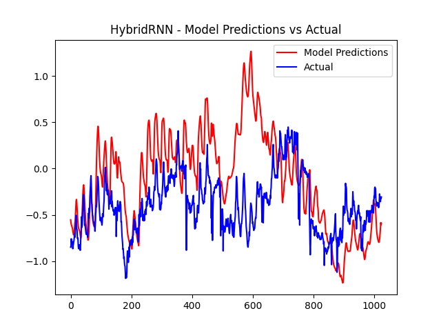
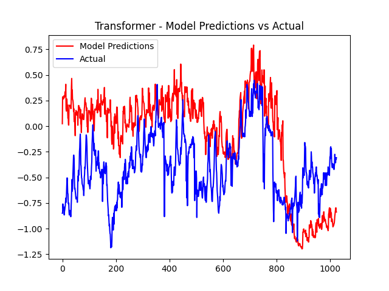

# HybridRNN Time Series Forecasting Project

This project implements a Hybrid Recurrent Neural Network (RNN) for time series forecasting. Time series forecasting is a common problem in various domains, including finance, weather prediction, and energy consumption analysis. This project aims to provide a robust solution for forecasting time series data using a hybrid model that combines both LSTM and GRU layers for improved performance.

## Project Structure

The project consists of several Python files, each with its specific purpose and functionality:

### `main.py`

The `main.py` file serves as the entry point of the project. It encapsulates the main workflow, which includes data setup, defining model hyperparameters, training the model, and evaluating its performance. Here's an overview of what this file does:

- Set the data directory and file paths, including the location of the training data and the path to save the best model.
- Define model hyperparameters such as sequence length, input size, hidden size, number of layers, output size, batch size, learning rate, and the number of training epochs.
- Create the `saved_models` directory to store model checkpoints.
- Initialize the data loader and obtain data loaders for training, validation, and testing.
- Load a pre-trained model if available or initialize a new model.
- Train the model using the specified criterion (mean squared error) and save the best model based on the validation loss.
- Evaluate the trained model on the test data and visualize the results.

### `load_model.py`

The `load_model.py` file contains functions for loading pre-trained models or initializing new ones. It performs the following tasks:

- List all model files in the `saved_models` directory that start with "epoch_" to find saved models.
- Extract and store epoch numbers from the saved model filenames and identify the latest epoch.
- Load the model from the last epoch or initialize a new model if no saved models are found.
- The loaded model is an instance of the `HybridRNN` class defined in `model.py`.

### `data_loader.py`

The `data_loader.py` file is responsible for loading and processing time series data. It defines two key classes:

- `TimeSeriesDataset`: This custom dataset class loads data from CSV files located in the specified data directory. It also scales the features using Min-Max scaling, ensuring that the data is appropriately normalized for training. Each data point in the dataset consists of input feature vectors and corresponding target values.

- `MyDataLoader`: This class extends the PyTorch `DataLoader` and provides a convenient interface for splitting the dataset into training, validation, and test sets. It allows you to specify the sequence length and batch size for the data loaders.

### `model.py`

The `model.py` file defines the architecture of the HybridRNN model and includes a Transformer model. The HybridRNN is designed for time series forecasting, providing flexibility with a choice between LSTM and GRU layers. Below is an extended overview of both the `HybridRNN` and `Transformer` classes:

#### HybridRNN Class

The `HybridRNN` class is initialized with the following parameters:

- `input_size`: The size of the input feature vectors.
- `hidden_size`: The number of hidden units in the RNN layers.
- `output_size`: The size of the output.
- `num_layers`: The number of RNN layers.
- `num_heads`: Number of attention heads in the multi-head attention models.
- `use_lstm` (default True): Whether to use LSTM layers.
- `use_gru` (default True): Whether to use GRU layers.

The class contains LSTM and GRU layers, and the output from these layers is concatenated if both are used. The fully connected layers are then applied to the concatenated output for the final prediction.

The forward method of the model takes an input tensor `x` with shape `(batch_size, sequence_length, input_size)` and performs the following steps:

- If both LSTM and GRU are used, it computes the output of both layers and concatenates them along the feature dimension.
- If only LSTM or GRU is used, it computes the output of the respective layer.
- The fully connected layers are applied to the output, and the last time step's prediction is extracted using slicing (`[:, -1:, :]`).
- The final output is obtained by squeezing the tensor.

#### Transformer Class

The `Transformer` class is designed for sequence-to-sequence tasks and includes the following components:

- `embedding`: Linear layer for input feature embedding.
- `transformer`: `nn.Transformer` module with parameters:
  - `d_model`: Hidden size of the model.
  - `nhead`: Number of attention heads.
  - `num_encoder_layers`: Number of transformer encoder layers.
  - `num_decoder_layers`: Number of transformer decoder layers.

The forward method of the model takes an input tensor `x` with shape `(batch_size, sequence_length, input_size)` and performs the following steps:

- Embeds the input features using the linear embedding layer.
- Permutes the tensor for compatibility with the transformer.
- Passes the tensor through the transformer layers.
- Reshapes the output back to the original shape.
- Applies fully connected layers to obtain the final prediction for each time step.

Note: Ensure thorough testing and consideration of your specific use case before deploying this code in a production environment.

### `trainer.py`

The `trainer.py` file is responsible for training the time series forecasting model. It includes the following functions and features:

- **`visualize_time_series_predictions_and_save` Function:**
    - This function visualizes and saves time series predictions during training. It creates line plots for the target and predicted data, saving them as image files.
    - Inputs:
      - `target_series`: Actual time series data.
      - `predicted_series`: Model's predicted time series data.
      - `predictions_dir`: Directory to save the prediction images.
      - `epoch`: Current epoch number.
      - `phase`: Training or validation phase.

- **`train_model` Function:**
    - The core of the training process, this function trains the model with specified hyperparameters and data.
    - Inputs:
      - `model`: The time series forecasting model.
      - `criterion`: Loss criterion (e.g., mean squared error).
      - `train_loader`: Data loader for training data.
      - `validation_loader`: Data loader for validation data.
      - `start_epoch`: The initial training epoch.
      - `num_epochs`: The total number of training epochs.
      - `best_loss`: The best validation loss.
      - `best_model_path`: Path to save the best model checkpoint.
      - `learning_rate`: The learning rate for the optimizer.
      - `saved_models_dir`: Directory for saving model checkpoints.
      - `predictions_dir`: Directory for saving prediction images.
    - The function:
        - Initializes an Adam optimizer with the specified learning rate to update model weights.
        - Tracks training and validation losses over epochs.
        - Saves the model with the best validation loss as a checkpoint.
        - Generates a training and validation loss plot for visualization.
        
- **Training Loop:**
    - Within the training loop, the `train_model` function iterates through each batch in the training data, computes the loss, backpropagates gradients, and updates model parameters.
    - It also tracks target and predicted time series data for visualization.

### `evaluator.py`

The `evaluator.py` file is used for evaluating the model's performance on the test data. It contains functions for loading the best model, calculating the test loss, and visualizing the model's predictions compared to the actual data. Here are the key features:

- The `evaluate_model` function loads the best model's weights and evaluates it on the test data.
- Test losses are calculated and reported.
- The model's predictions are compared to the actual target values, and the results are visualized in a plot.

## Dataset

The dataset used in this project is the ETDataset, which is available on [GitHub](https://github.com/zhouhaoyi/ETDataset). This dataset consists of time series data related to energy consumption, environmental conditions, and other factors. To use this dataset with the project, follow these steps:

1. **Download the Dataset**: Visit the [ETDataset GitHub repository](https://github.com/zhouhaoyi/ETDataset) and follow the provided instructions to download the dataset. Ensure that you have access to the required CSV files containing the time series data.

2. **Data Directory**: Set the `data_dir` variable in the `main.py` file to the directory where you have stored the ETDataset CSV files. This will be the directory where the project loads data from.

3. **Data Preprocessing**: It's important to preprocess the dataset appropriately, as the code assumes that the data is stored in CSV files and may require scaling or other transformations. The `TimeSeriesDataset` class in `data_loader.py` handles data loading and preprocessing, such as Min-Max scaling, but ensure that the data format matches your specific use case.

## Results

The results on test dataset is shown below:

## Usage

To run the project and make use of the provided functionalities, you should execute the `main.py` script. Ensure that you have the necessary dependencies installed, including PyTorch, pandas, NumPy, and Matplotlib.

The project is designed for time series forecasting tasks and can be customized for various applications. By replacing the dataset and adjusting the model hyperparameters, you can adapt it to different forecasting scenarios.

The documentation within the code and comments in each Python file provide more specific details about how to use and configure the project components.

If you have any questions or need assistance with the project, please reach out to the project author.

This project offers a powerful tool for time series forecasting, combining the strengths of LSTM and GRU layers in a modular and extensible structure.

## Conclusion

This project provides a comprehensive solution for time series forecasting using a hybrid RNN model. The combination of LSTM and GRU layers allows for capturing complex patterns and dependencies in time series data. It is a versatile tool that can be applied to various forecasting tasks, including energy consumption, weather prediction, and financial forecasting.

By following the instructions and integrating your dataset, you can utilize this project to develop accurate time series forecasting models tailored to your specific domain and data.

Feel free to clone and change the model or structure.

Happy forecasting!
